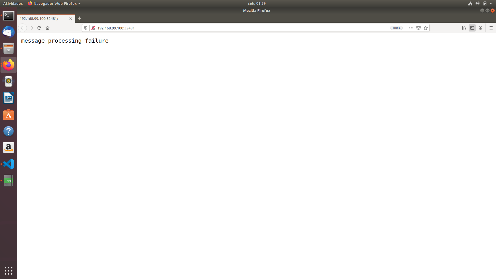
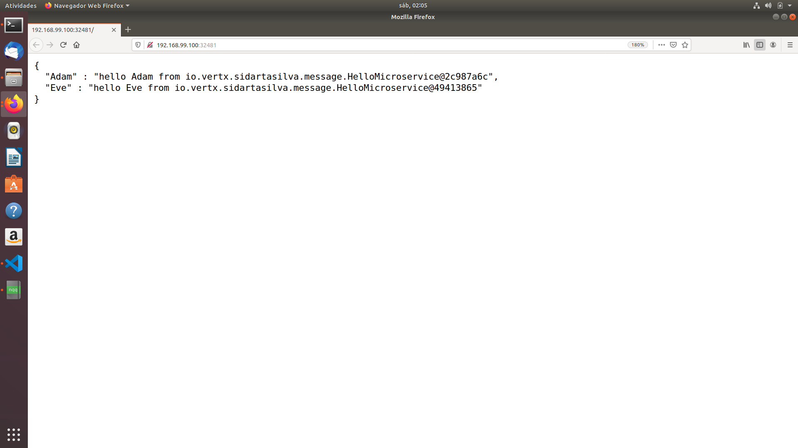
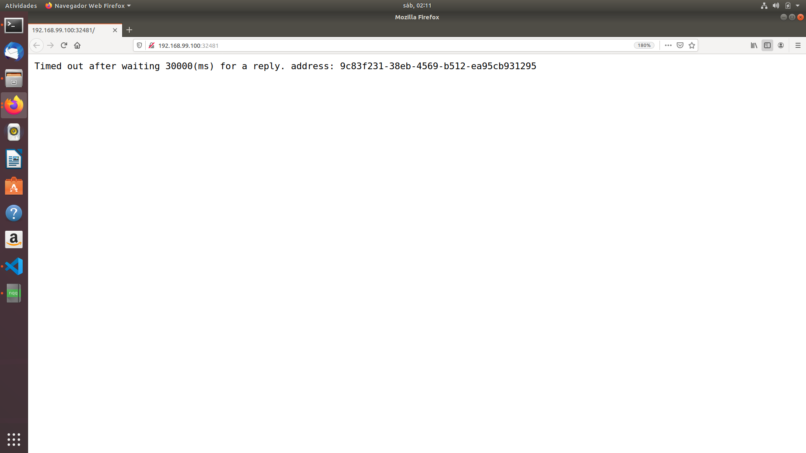
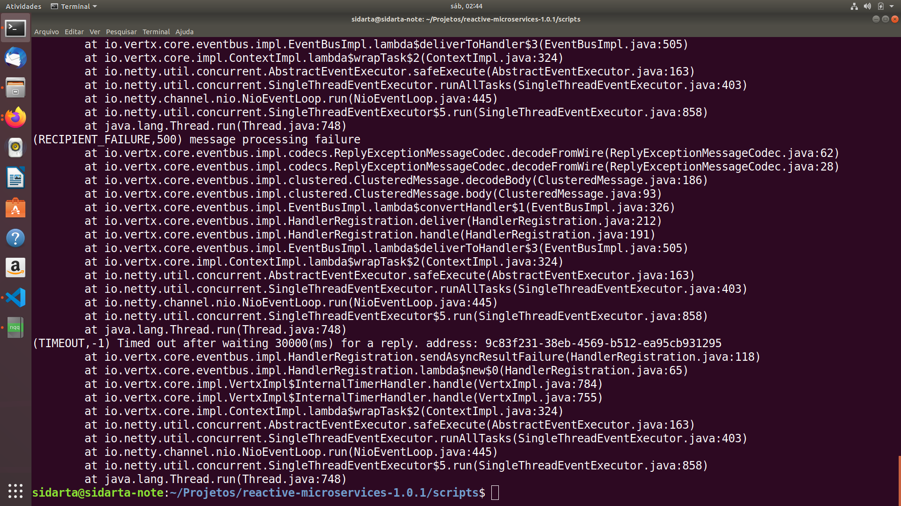
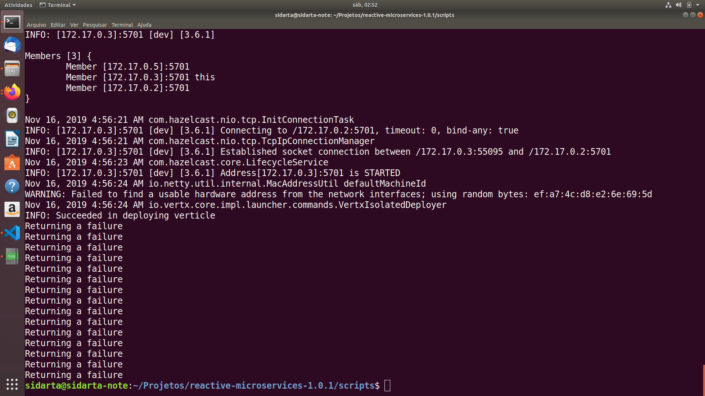
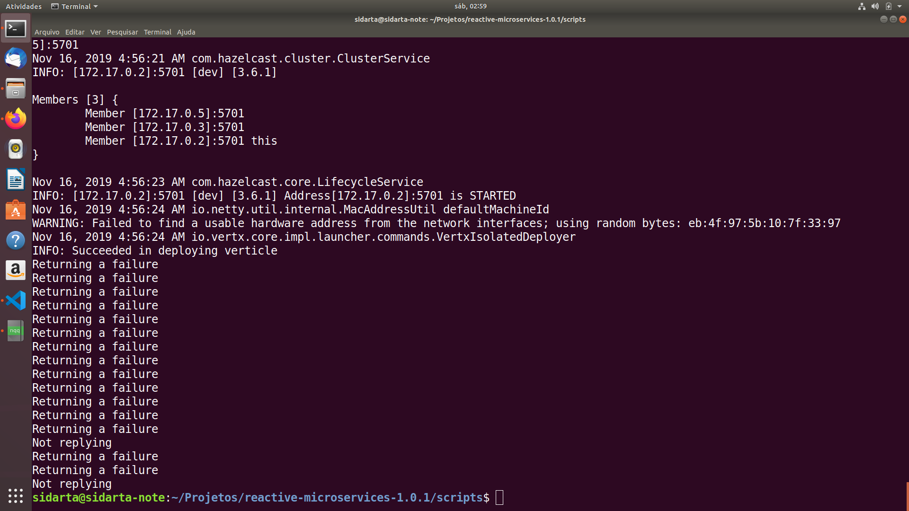

# Initiating Message-Based Interactions

### Resilience

With the fault injection in place, we need to improve the fault-tolerance of our consumer. Indeed, the consumer may get a timeout or receive an explicit failure. 

In the hello consumer microservice, let's change how we invoke the hello service to:

      EventBus bus = vertx.eventBus();

      Single<JsonObject> obs1 = bus
          .<JsonObject>rxSend("hello", "Adam")
          .subscribeOn(RxHelper.scheduler(vertx))
          .timeout(3, TimeUnit.SECONDS)
          .retry()
          .map(Message::body);

      Single<JsonObject> obs2 = bus
          .<JsonObject>rxSend("hello", "Eve")
          .subscribeOn(RxHelper.scheduler(vertx))
          .timeout(3, TimeUnit.SECONDS)
          .retry()
          .map(Message::body);

The timeout method emits a failure if we don't receive a response in the given time. The retry method reattempts to retrieve the value if it gets a failure in the form of a timeout or an explicit failure.

The subscribeOn method indicates on which thread the invocations need to be done. We use the Vert.x event loop to call our callbacks. Without this, the methods would be executed by a thread from the default RxJava thread pool, breaking the Vert.x threading model.

The RxHelper class is provided by Vert.x. Blindly retrying service invocations is not a very clever fault tolerance strategy. It can even be harmful.

Now we can reload the page. We will always get a result, even if there are failures or timeouts. 

Let's remember that the thread is not blocked while calling the service, so we can always accept new requests and respond to them in a timely fashion. 

However, this timeout retry often causes more harm than good.

### Rebuilding Applications to Docker images

Let's rebuild our Docker images for the applications and push them all into our Docker Hub repository:

      docker build -t project00# .
      docker images
      docker tag [Image Id] sidartasilva/project00#:latest
      docker push sidartasilva/project00# 

### Rebuilding Docker Images to Kubernetes

After that we should rebuild our Docker images to Kubernetes. For doing so we'll run the following script file:

    ./deploy-all.sh

### Deploy-all Script file

      #!/usr/bin/env bash
      echo "Building microservice JARs through the modules"
      echo ""
      cd ../
      mvn clean install

      echo ""

      echo "Copying fat JARs to be Dockerized"

      echo ""

      echo "Copying project-004 fat JAR to project folder"
      cd project-004
      cp target/project-004-1.0-SNAPSHOT.jar .
      echo "Ok"

      echo ""

      echo "Copying project-005 fat JAR to project folder"
      cd ../project-005
      cp target/project-005-1.0-SNAPSHOT.jar .
      echo "Ok"

      echo ""

      echo "Deploying microservices to Kubernetes through the YAMLs"

      echo ""

      echo "Deploying the hello microservice application"
      cd ../project-004/yaml
      kubectl apply -f rbac.yaml

      kubectl apply -f deployment.yaml

      echo ""

      echo "Deploying the hello-consumer microservice application"
      cd ../../project-005/yaml
      kubectl apply -f .

      echo ""

      echo "Well done!"    

### First page reload

### Second page reload

### After many page reloads

Then, after trying many page reloads, we finally come accross a timeout.

### Checking up on the Logs After Timeout

Now let's have a look into the logs after the timeout.

      sidarta@sidarta-note:$ kubectl get po

      NAME                          READY   STATUS    RESTARTS   AGE
      project004-67cf878658-99gsp   1/1     Running   0          42m
      project004-67cf878658-l9wpw   1/1     Running   0          42m
      project005-64d668db48-d2ckm   1/1     Running   0          42m

Firstly, let's have a look into the logs of hello consumer microservice's Pod.

    kubectl logs project005-64d668db48-d2ckm

Secondly, let's have a look into the logs from the second Pod of hello microservice.

      kubectl logs project004-67cf878658-l9wpw

And thirdly, let's have a look into the logs from the first Pod of hello microservice.

      kubectl logs project004-67cf878658-99gsp

### Next steps

Now, we know how to build reative microservices, but there are a couple of shortcomings we need to look at. 

First, what if we only have Http services?

How do we avoid hard-coded locations?

What about resilience?

We have seen timeouts and retries, but what about circuit breakers, failovers, and bulkheads? 

